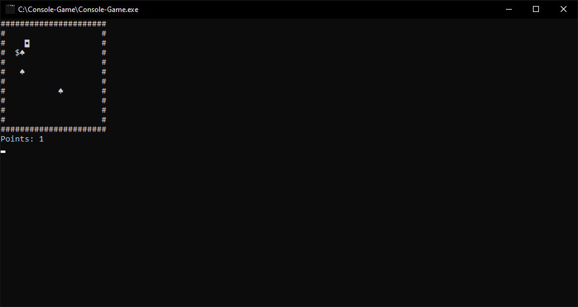
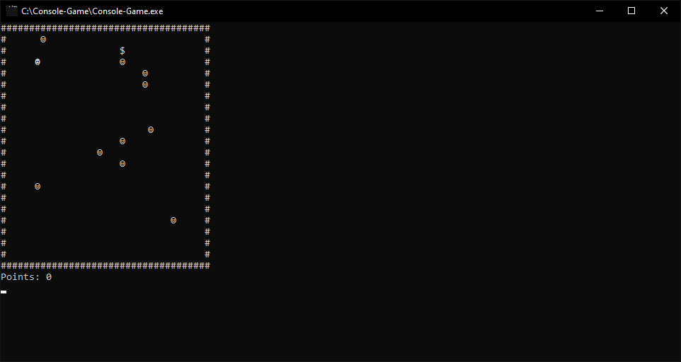
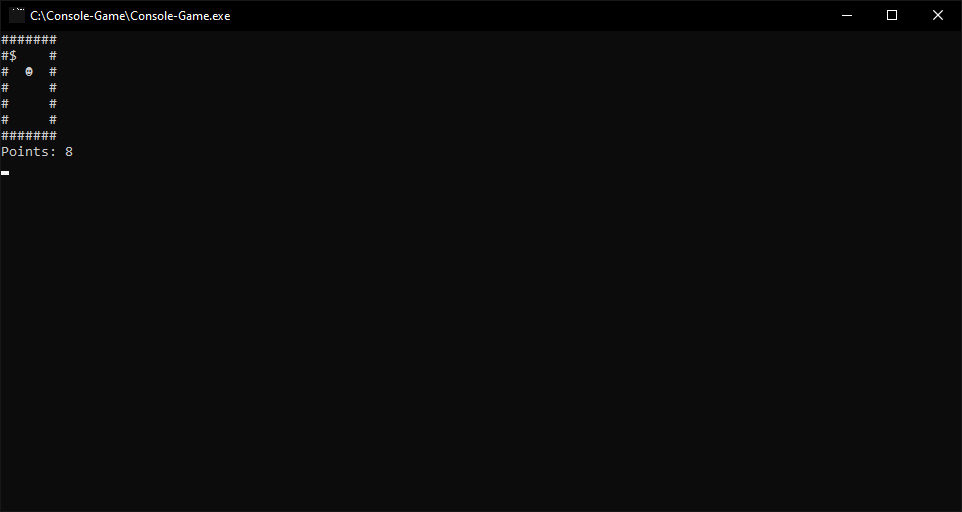
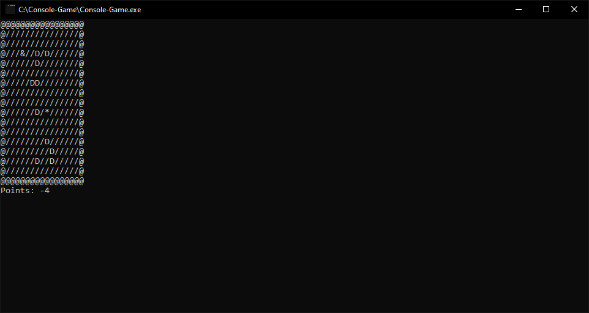

# Console-Game 
It's a really tiny project that is a game you can play in console. If you want to change settings without changing code, use [ConfigCG.json](rc/ConfigCG.in.json) file.

### Version
1.5.2

## Table of contents
* [General info](#general-info)
* [Dependencies](#dependencies)
* [Building](#building)
* [Screenshots](#screenshots)
* [Config](#config)


## General info
There you moving by a some face character or different, and you have to earn some points by moving on dollar or different character. There actually nothing more.

## Dependencies
This projects uses ncurses in wide version and [nlohmann JSON](https://github.com/nlohmann/json).

## Building
To build Console-Game you need to have installed at last [cmake 3.0](https://cmake.org/download/) and use it to build.  
**TO COMPILE IT ON WINDOWS YOU NEED MINGW COMPILER**. [Here](https://github.com/jackvz/ncurses-examples/) you have tutorial.

This example shows how to do it on linux with make.

```sh
git clone https://github.com/cooligus/console-game/
cd console-game
cmake -B build/
make
```

## Screenshots





## Config
If you want to use config you must put it into same folder as Console-Game. There are all variables you can change. You delete them if you want and in this case game will use default content of delete variable. But remember config doesn't support emoji. [See config file.](rc/ConfigCG.in.json)

```json
{
  "config": {
    "sizeX": 20,
    "sizeY": 10,
    "enemiesAmount": 3,
    "addFrames": true,
    "replaceSpaceByFrame": false,
    "spaceChar": " ",
    "frameChar": "#",
    "playerSprite": "P",
    "enemySprite": "E",
    "pointSprite": "$"
  }
}
```
